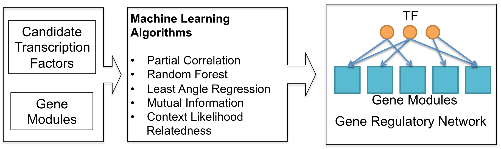
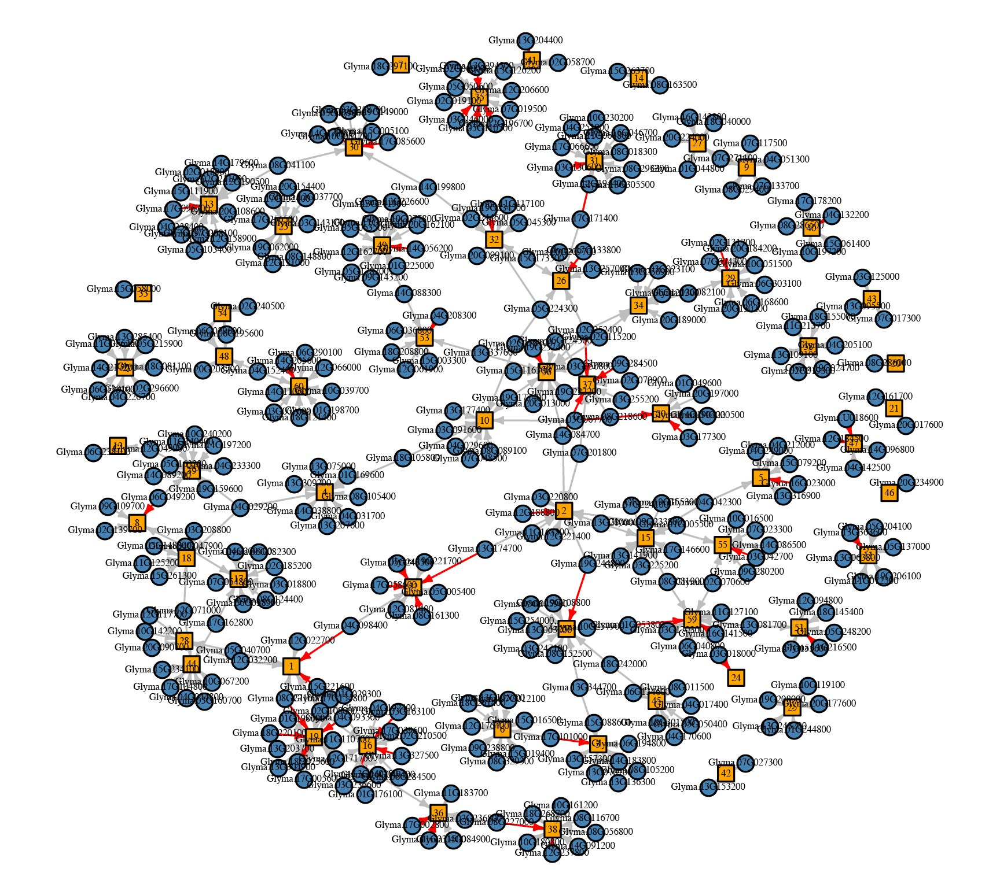

## Welcome to Soybean LPA Gene Network

We applied five machine learning methods to learn gene regulatory networks from RNAseq data generated during soybean seed development. 

These machine learning methods include:

* Mutual Information [(ARACNE)](https://doi.org/10.1186/1471-2105-7-S1-S7) 
* Random Forest [(RF)](https://doi.org/10.1371/journal.pone.0012776)
* Context Likelihood Relatedness [(CLR)](https://doi.org/10.1371/journal.pbio.0050008)
* Least Angle Regression [(LARS)](https://doi.org/10.1186/1752-0509-6-145)
* Partial Correlation [(PCOR)](https://doi.org/10.1093/bioinformatics/bti062)



#### Usage
##### Input data
Input data include gene expression from a time series experiment or multiple tissue types. Data should be in matrix format. With each row represents the expression pattern of a transcription factor (TF), or a gene module. Gene module can be obtained using clustering method. A sapmle input [data](TFandModule.csv) is provided for 30 transcription factors and 60 gene modules. Each row is the expression data for one gene or a module. Column 1 is the gene names and module names.  Other columns are experimental conditions.

##### Perform network analysis
Name the input data as TFandModule.csv, run the R code using Rstudio or Rscript command. For example, if you want to run the ARACNE method, use the following command.

```bash
Rscript NetworkLearning_ARACNE.R
```

This will create a file called "aracne_network_edges.csv" in the current working directory.


##### Output 

